# 系統架構總覽 (System Architecture Map)
> **版本**：V4.2.0 | **更新日期**：2026-07-27 | **技能總數**：65 個

此文件為自動化工作站的「大腦地圖」，定義了所有 Skills 的相互呼叫關係與核心執行目的。為確保系統穩定與代理人邏輯清晰，所有技能均歸類於三大核心維度：調度與流程控制、認知與角色框架、執行與自動化工具。

> [!IMPORTANT]
> **V3.0.0 命名規範**：所有技能名稱均採用**無前綴 1:1 映射**原則（已廢除 `sys-`、`finance-`、`tool-`、`persona-` 前綴）。
> 技能的唯一識別碼為其目錄名稱，與 `Data/00_Skill_Manifest.json` 的 key 完全一致。

---

## 系統拓樸圖 (System Topology)

```mermaid
graph TD
    %% 定義樣式
    classDef orchestrator fill:#f9d0c4,stroke:#333,stroke-width:2px;
    classDef cognitive fill:#c4e1f9,stroke:#333,stroke-width:2px;
    classDef execution fill:#d1f9c4,stroke:#333,stroke-width:2px;
    classDef system fill:#e2c4f9,stroke:#333,stroke-width:2px;

    %% 根節點
    Root((Master Menu)):::system

    %% 第一層次：調度中心 (Orchestrators)
    subgraph 01_Orchestrators ["🧠 01_Orchestrators (調度與流程控制) — 19 個技能"]
        SysGov(skill-governance-skill)
        DevSOP(twse-dev-sop-skill)
        ResLoop(quant-research-loop)
        SubCollab(subagent-collaboration-skill)
        AutoRes(autoresearch-agent)
        StockOrch(stock-orchestrator-skill)
    end

    %% 第二層次：認知大腦 (Cognitive Models)
    subgraph 02_Cognitive ["👁️ 02_Cognitive (認知與角色框架) — 19 個技能"]
        TWSELogic(twse-market-logic-skill)
        TechAna(tech-analyzer)
        SentScout(sentiment-scout)
        FinAna(financial-analyst)
    end

    %% 第三層次：執行手腳 (Execution Scripts)
    subgraph 03_Execution ["⚙️ 03_Execution (執行與自動化工具) — 28 個技能"]
        WebTest(webapp-testing)
        D3Viz(d3js-visualization)
        SysDebug(systematic-debugging-skill)
        MCPSetup(mcp-engineer)
        Postgres(postgres)
        LangSmith(langsmith-fetch)
        SkillCreator(skill-creator)
        TGBot(telegram-bot-cdp-bridge)
    end

    %% 依賴與呼叫關係
    Root --> 01_Orchestrators

    SysGov -.監控與管理.-> 02_Cognitive
    SysGov -.監控與管理.-> 03_Execution

    DevSOP --> SubCollab
    DevSOP --> TWSELogic
    DevSOP --> WebTest
    DevSOP --> D3Viz

    ResLoop --> TechAna
    ResLoop --> Postgres

    AutoRes --> SubCollab
    AutoRes --> LangSmith

    StockOrch --> TWSELogic
    StockOrch --> FinAna

    %% 賦予顏色
    class SysGov,DevSOP,ResLoop,SubCollab,AutoRes,StockOrch orchestrator;
    class TWSELogic,TechAna,SentScout,FinAna cognitive;
    class WebTest,D3Viz,SysDebug,MCPSetup,Postgres,LangSmith,SkillCreator,TGBot execution;
```

---

## 多維度檢索目錄 (Multi-dimensional Index)

### 🧠 01_Orchestrators (調度與流程控制) — 19 個技能
負責分配任務、管理全域狀態與自動化迴圈的總控 SOP。

| 技能目錄 | 核心目的摘要 (存在意義與輸入/輸出) |
| :--- | :--- |
| **agency-orchestrator-skill** | **萬能總管模式**（最高總管）：通用意圖解析與全局任務拆解，執行 4-Phase 狀態機工作流。 |
| **skill-governance-skill** | **生命週期管理**：審計與管理技能生態系統，輸入檢測目標，輸出治理建議。 |
| **subagent-collaboration-skill** | **任務隔離與派發**：執行多步驟任務，防止上下文污染。輸入複雜任務，輸出子代理人執行結果。 |
| **autoresearch-agent** | **超參數優化**：微型 AI 模型的自動化優化代理人。精準觸發詞：`$$自動化_微型模型$$`（由 agency-orchestrator-skill 攔截 `$$自動化$$` 後派發）。 |
| **recursive-research-automation** | **遞迴研究框架**：通用自動化研究循環。精準觸發詞：`$$自動化_通用研究$$`。輸入研究主題，輸出深度調研報告。 |
| **optimization-status** | **優化狀態監控**：監控超參數實驗進度。輸入環境狀態，輸出進度與指標。 |
| **quota-monitor-skill** | **資源熔斷機制**：監控 API Quota 並實施 10% 熔斷防護。 |
| **quant-research-loop** | **量化研究自動迴圈**：金融實驗與策略驗證。精準觸發詞：`$$自動化_量化實驗$$`。輸入市場假說，輸出策略回測結果。 |
| **twse-dev-sop-skill** | **專案開發 SOP**：台股網站開發的標準作業程序，整合圖表實作與驗證。 |
| **handover-manual-skill** | **知識移交**：標準化的專案上下文與知識轉移手冊。 |
| **reality-checker** | **品質保證**：審核計畫、架構與代碼的技術可行性，過濾幻覺。 |
| **reflection-module** | **自我反思**：具前瞻性的行為優化模組，整合多代理人協作。 |
| **stock-orchestrator-skill** | **台股分析總管**：整合技術面、籌碼面、基本面的台股分析協調器。 |
| **active-inference** | **主動推斷**：基於 Active Inference 框架的決策推理引擎。 |
| **cost-benefit-router** | **成本效益路由**：動態評估任務成本效益並選擇最優執行路徑。 |
| **episodic-consolidation** | **情節記憶固化**：將短期情境記憶轉化為長期知識的整合引擎。 |
| **global-workspace** | **全域工作空間**：管理跨技能的共享上下文與全局狀態廣播。 |
| **self-improvement** | **自我改進**：分析執行歷史並生成系統優化建議的自進化引擎。 |
| **security-auditor** | **資安審計官** [NEW]：程式碼合併/API 串接前的安全防火牆。掃描 SQL Injection、XSS、API 密鑰外洩。 |

---

### 👁️ 02_Cognitive (認知與角色框架) — 19 個技能
負責特定領域分析、思維推論與角色扮演的認知引擎。

| 技能目錄 | 核心目的摘要 (存在意義與輸入/輸出) |
| :--- | :--- |
| **twse-market-logic-skill** | **台股市場深度邏輯**：恐慌指數、分層確認、MSTL 預測。輸入市場數據，輸出情緒與方向判斷。 |
| **tech-analyzer** | **技術分析專家**：價格形態與量能結構分析。輸入 K 線與量價資料，輸出趨勢指標與反轉訊號。 |
| **financial-analyst** | **財務分析師**：估值建模、比率分析與財務風險評估。 |
| **sentiment-scout** | **情緒偵察**：新聞與論壇情緒解讀。輸入文本資料，輸出市場情緒分數與關鍵敘事。 |
| **investment-researcher** | **投資研究員**：台股產業研究、個股基本面與量化趨勢分析。 |
| **evidence-collector** | **證據收集官**：為所有決策提供事實支撐、鏈接與原始數據。 |
| **backend-architect** | **後端架構師**：API 設計、資料庫 Schema 與資料流優化。 |
| **data-engineer** | **資料工程師**：ETL 流程、資料清洗與標準化。 |
| **devops-engineer** | **運維工程師**：環境配置、CI/CD、部署策略與系統監控。 |
| **frontend-developer** | **前端開發工程師**：UI/UX 邏輯、組件實作與互動設計。 |
| **software-architect** | **軟體架構師**：系統高層設計、模式定義與技術選型。 |
| **declarative-visual-intent-generator** | **聲明式視覺意圖生成器**：從高層需求生成結構化的視覺呈現規格。 |
| **dynamic-tool-synthesizer** | **動態工具合成器**：根據任務需求動態組合最優工具集的推理引擎。 |
| **epistemic-state-governor** | **認識論狀態管理器**：追蹤系統的知識邊界與不確定性狀態。 |
| **real-time-stream-orchestrator** | **即時串流協調器**：管理多資料源的即時資料流整合與分發。 |
| **investment-aggregator** | **投資聚合器**：彙整多維度投資訊號並生成綜合評分。 |
| **json-to-flex-renderer** | **JSON to Flex 渲染器**：將結構化 JSON 資料轉換為 LINE Flex Message。 |
| **market-researcher** | **市場研究員**：深度市場調查、競品分析與產業趨勢洞察。 |
| **twse-data-analyst** | **台股資料分析師**：處理 TWSE/FinMind API 數據的清洗、統計與視覺化。 |

---

### ⚙️ 03_Execution (執行與自動化工具) — 28 個技能
負責具體程式碼運作、檔案操作、外部 API 串接或環境配置的實體技能。

| 技能目錄 | 核心目的摘要 (存在意義與輸入/輸出) |
| :--- | :--- |
| **systematic-debugging-skill** | **系統排錯專家**：解決 MCP、npm、設定檔語法等異常。輸入錯誤日誌，輸出修正方案。 |
| **skill-creator** | **技能建構指南**：建立高效技能的工作流指引。輸入功能需求，輸出符合規範的技能目錄與 SKILL.md。 |
| **artifacts-builder** | **前端成品建構器**：使用 React/Tailwind/shadcn 建立 Web 成品。 |
| **webapp-testing** | **Web 應用測試**：使用 Playwright 驗證本地前端。輸入測試路徑，輸出結果與螢幕截圖。 |
| **playwright-automation** | **瀏覽器自動化**：編寫測試腳本、截圖與驗證。 |
| **d3js-visualization** | **資料視覺化實作**：使用 d3.js 建立 SVG/互動圖表。 |
| **pe-river-map** | **本益比河流圖工具**：視覺化長期投資評估的 PE Band 圖。 |
| **notebooklm-mcp** | **NotebookLM 串接**：操作 Google NotebookLM 生成內容或摘要。 |
| **mcp-builder** | **MCP 開發指南**：建立高品質 MCP 伺服器的標準流程。 |
| **mcp-setup** | **MCP 環境配置**：在本地環境設定或排錯 MCP 伺服器。 |
| **mcp-gateway** | **MCP 閘道器**：管理多個 MCP 伺服器的統一存取閘道。 |
| **gemma-4-api** | **Gemma API 串接**：Google AI Studio API 的 SOP，含限流與思考模式配置。 |
| **langsmith-fetch** | **LangSmith 追蹤**：抓取執行追蹤以偵錯代理人行為。 |
| **postgres** | **資料庫查詢**：安全執行唯讀 SQL 查詢，支援結構探索與資料分析。 |
| **csv-data-summarizer** | **CSV 分析器**：使用 pandas 分析資料與繪圖。 |
| **xlsx** | **Excel 處理**：讀寫與格式化試算表。 |
| **pdf** | **PDF 操作**：提取、合併、加密、OCR 等完整 PDF 工具集。 |
| **image-enhancer** | **圖像畫質提升**：優化截圖與簡報圖像的解析度與銳利度。 |
| **canvas-design** | **視覺藝術生成**：建立靜態海報或設計圖，輸出 PDF/PNG。 |
| **theme-factory** | **主題工廠**：為成品設定視覺風格與色彩，含 10 個預設主題。 |
| **changelog-generator** | **發佈日誌生成**：分析 Git 提交生成客戶端 Release Notes。 |
| **connect-apps** | **外部應用整合**：連接 Gmail、Slack、GitHub 等外部服務。 |
| **tool-executor** | **通用工具執行器**：統一介面執行各類系統工具指令。 |
| **line-bot-zero-delay** | **LINE Bot 零延遲服務**：優化 LINE Bot 的回覆速度與非同步處理架構。 |
| **line-interaction-manager** | **LINE 互動管理器**：管理 LINE Bot 的對話狀態、選單與用戶互動流程。 |
| **ui-prototype-builder** | **UI 原型建構器**：用 HTML 製作高保真原型、互動 Demo 與動畫設計。 |
| **mcp-engineer** | **MCP 工程師** [NEW]：整合原 mcp-builder + mcp-setup，覆蓋 MCP 工具完整生命週期。 |
| **workspace-migration-recovery** | **工作站遷移復原** [防禦技能]：系統環境遷移後的路徑修復與架構完整性驗證。 |
| **telegram-bot-cdp-bridge** | **Telegram Zero-Delay 橋接器** [V14.2]：透過 Zero-Delay HTTP Long-Polling 架構，讓 Agent 透過 Telegram 接收指令並回覆。採長駐阻塞式輪詢，Port 3001 獨立運行，與 LINE Bridge 完全隔離。 |

---

## 系統支柱資料層 (Data Layer)

| 資料檔案 | 說明 | 重要性 |
| :--- | :--- | :--- |
| `Data/00_Skill_Manifest.json` | 技能索引（65條，唯一真實來源） | 🔴 CRITICAL |
| `Data/skill_translations.json` | 技能中文名稱與別名對照 | 🟠 HIGH |
| `Data/personas/` | 15 個人物思維框架目錄 | 🟡 MEDIUM |
| `Modules/db_state_manager.js` | Neon DB 狀態管理（Watchdog 寫入） | 🔴 CRITICAL |
| `Modules/quota_manager.js` | 配額監控與熔斷機制 | 🔴 CRITICAL |

---

*本文件由 Antigravity 總管於 2026-07-16 更新至 V4.1.0，完成 V4 Patch 優化計畫：封存幽靈與冗餘節點，架構地圖與 65 技能 Manifest 完全同步。*

---

## 雙生遙控通訊架構 (LINE & Telegram Shared Bridge)

為了降低跨平台維護成本，系統中負責遠端通訊的 **LINE Bot (line-bot-zero-delay)** 與 **Telegram Bot (telegram-bot-cdp-bridge)** 已全面整合為「不同種類、相同屬性」的孿生橋接器架構。未來無論是新增平台或維護現有功能，皆應遵循以下三大共用支柱：

1. **資料安全層 (DLP Sanitizer)**
   雙邊皆強制引用 `Modules/shared/dlpSanitizer.js`，確保外發之對話不會洩漏 API 金鑰、JWT 或資料庫密碼。
2. **日誌歸檔層 (Atomic Write Queue)**
   雙邊的對話紀錄統一寫入 `C:\Users\HH.AI_260806\Desktop\Line對話紀錄\萬能總管`，並具備非同步佇列與 EBUSY 鎖死防禦機制。
3. **服務守護層 (PM2 Exemption)**
   皆受 `SOP_05` PM2 雙開特許白名單保護，直接與 IDE CDP (Port 9229) 接口通訊，擁有最高等級的系統操作權。

> 📖 **完整歷程與權威規範文件**：請參閱 [SOP_15_OmniChannel_Connection_Development_History.md](file:///c:/Users/HH.AI_260726/Desktop/HH.AI_260726/SOP/SOP_15_OmniChannel_Connection_Development_History.md) 了解 LINE 與 Telegram 通訊模組的所有開發演進細節與實務運作 SOP。

