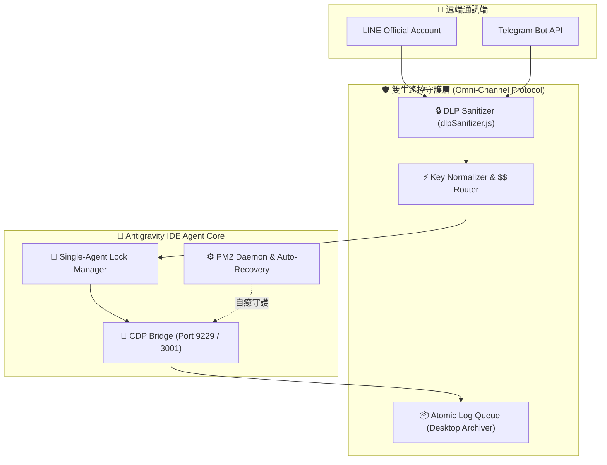

# SOP_15：雙平台 (LINE & Telegram) 連線開發歷程與系統架構權威報告
> **版本**：V1.0.0 | **更新日期**：2026-07-27 | **維護角色**：系統架構師團隊 (software-architect & backend-architect) & 萬能總管

---

## 一、系統架構師定位與責任劃分 (System Architect Charter)

在自動化工作站架構中，系統架構由以下兩大認知角色聯合奠基與維護：

1. **軟體架構師 ([software-architect](file:///c:/Users/HH.AI_260726/Desktop/HH.AI_260726/skills/02_Cognitive/software-architect/SKILL.md))**：
   - 負責高層系統分解、設計模式（如 Observer、Event-Driven Pipeline、Task-Exit Loop）與技術選型。
   - 主導「雙生遙控通訊架構 (Omni-Channel Bridge)」之隔離性、高併發與自我復原機制。
2. **後端架構師 ([backend-architect](file:///c:/Users/HH.AI_260726/Desktop/HH.AI_260726/skills/02_Cognitive/backend-architect/SKILL.md))**：
   - 負責 CDP (Chrome DevTools Protocol) 協定對接、HTTP Long-Polling 介面規格與資料庫 (SQLite / Neon DB) Schema 設計。
   - 確保全域 DLP 資料安全監控與雙向 Key 正規化邏輯嚴謹落地。

---

## 二、Telegram 連線開發歷程 (Telegram CDP Bridge Timeline)

Telegram 通訊模組歷經多個版本的迭代演進，詳細變更紀錄歸檔於 [CHANGELOG.md](file:///c:/Users/HH.AI_260726/Desktop/HH.AI_260726/skills/03_Execution/telegram-bot-cdp-bridge/telegram-bot-project/CHANGELOG.md)，主要里程碑如下：

### 1. 初次發布期 (v0.1.0 — 2026-01-20)
- **核心架構**：採用 grammy 框架進行 Long-Polling（無須 Webhook 或 Port Forwarding），透過 WebSocket 連結 IDE CDP。
- **功能基石**：實現 Telegram Forum Topics 對應 Antigravity Projects、SQLite 持久化 Session 狀態、命令過濾（`/new`, `/chat`, `/project`）。

### 2. 結構化 UI 與 DOM 抽離期 (v0.2.0 — 2026-02-15)
- **DOM 提取重構**：從原本 `innerText` 全擷取升級為 `structured` 結構化 extraction。
- **動態回饋**：加入思考/文件操作/MCP 工具狀態 Emoji，實現 Planning Mode 檢測與 Proceed/Plan 決策推播。
- **多媒體擴充**：支援 Whisper 本地語音轉文字、圖片傳送與 `/autoaccept` 自動核准機制。

### 3. 細粒度調校與修復期 (v0.2.1 ~ v0.2.14 — 2026-03 ~ 2026-04)
- **併發防護**：引入 Workspace Prompt Locking，避免同工作區多主題衝突。
- **安全防護**：修正 HTML 實體轉義 (`&amp;`, `&lt;`, `&gt;`)，修復大文字 Code block 凍結。
- **對話框升級**：適應 Antigravity v1.21.6 DOM 結構變化（`<button>` 替換 `
`，修復單一終端核准按鈕相容性）。
- **洩露過濾**：防護 tool-call 輸出洩漏，僅抓取首段 assistant-body 內容。

---

## 三、LINE 連線開發歷程 (LINE Zero-Delay Pipeline Timeline)

LINE 遙控介面為追求「毫秒級響應」與「極致穩定性」，經歷了以下重大技術革命：

### 1. 傳統 polling 階段 (V1)
- 使用定時輪詢 (`cron` / `setInterval`) 檢查資料庫，延遲較高且資源浪費嚴重。

### 2. File Event & Cloudflare Tunnel 階段 (V2)
- 引進 `fs.watch` 檔案事件驅動，並透過 Cloudflare Tunnel 穿透本機 NAT，將回應時間縮短至毫秒級。
- 引入 Markdown Cleaner 與 Flex Message 獨立隔離視覺設計。

### 3. PM2 + Pinggy 隧道單核心守護階段 (V3)
- 全面廢除外部 `cloudflared.exe` 手動啟動模式，改由 PM2 全權守護 `bridge.js`。
- `bridge.js` 內建 Pinggy SSH 隧道管理，自動擷取試用公網 URL 並動態更新 LINE 官方 Webhook URL。
- 設定 Windows Task Scheduler (`Antigravity-LINE-Bridge`) 排程於開機後 60 秒自動背景加載。

### 4. V4 Task-Exit Loop 零延遲喚醒與雙生協定階段 (V4 / 現行)
- 導入 **Task-Exit Loop**：當背景監聽器 (`poll_inbox.js`) 接獲新訊息時，寫入 stdout 並執行 `process.exit(0)`，觸發 IDE 任務結束事件強制喚醒 Agent。
- 建立**雙生遙控通訊架構 (Omni-Channel Guardian Protocol)**：將 LINE 與 Telegram 之安全、歸檔、PM2 守護與特權指令邏輯統一化。

---

## 四、現行雙生遙控通訊架構 (Omni-Channel Guardian Protocol Specification)

LINE Bot ([line-bot-zero-delay](file:///c:/Users/HH.AI_260726/Desktop/HH.AI_260726/skills/03_Execution/line-bot-zero-delay/SKILL.md)) 與 Telegram Bot ([telegram-bot-cdp-bridge](file:///c:/Users/HH.AI_260726/Desktop/HH.AI_260726/skills/03_Execution/telegram-bot-cdp-bridge/telegram-bot-project/docs/ARCHITECTURE.md)) 已全面升級為共享底層的三大支柱架構：

### 核心運作三大標準規範 (SOP)：

1. **資安與對話歸檔規範 (DLP & Archive)**：
   - 雙平台外發訊息強制通過 [dlpSanitizer.js](file:///c:/Users/HH.AI_260726/Desktop/HH.AI_260726/Modules/shared/dlpSanitizer.js) 淨化，防範 API 金鑰與敏感資訊洩漏。
   - 所有對話記錄採用非同步 Atomic Queue 歸檔至 `C:\Users\HH.AI_260726\Desktop\Line對話紀錄\萬能總管`。

2. **特權語彙 ($$ Triggers) 精準路由與雙向 Key 正規化**：
   - 全形/半形自動轉化（`＄＄` 轉 `$$`），最大長度限 50 字元且須精確開頭與結尾。
   - 正規化消除空格轉小寫 (`.replace(/\s+/g, '').toLowerCase()`)。
   - `$$LINE連線$$` 與 `$$TG連線$$` 觸發單一 Agent 強制鎖定 (`true` 參數)，`$$Line帳號$$` 與 `$$TG帳號$$` 觸發 [bot-account-switcher](file:///c:/Users/HH.AI_260726/Desktop/HH.AI_260726/.agents/skills/bot-account-switcher/SKILL.md)。

3. **斷線自癒與接力監聽 SOP**：
   - Agent 回覆 Telegram / LINE 訊息後，必須依規定執行對應之接力監聽腳本：
     - LINE 接力：`node skills/03_Execution/line-bot-zero-delay/line-bot-project/start_line.js <AGENT_ID> "<LABEL>" true`
     - TG 接力：`node skills\03_Execution\telegram-bot-cdp-bridge\telegram-bot-project\poll_tg.js Antigravity-Master`

---

*本文件由 Antigravity 萬能總管與系統架構師團隊聯名編寫發布於 2026-07-27。*
